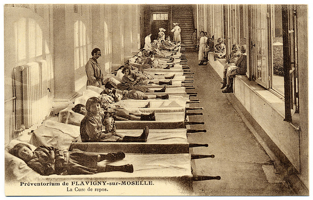

**Madrid, 23, 24 y 25 de octubre - 11, 12 y 13 de diciembre 2015**

El grupo de periodismo de datos de Medialab-Prado ha preparado para otoño una nueva convocatoria de proyectos de periodismo de datos. Si en 2013 escogimos el tema de la energía y en 2014 el del gasto público, en 2015 abordaremos un tema de mucha actualidad, la desigualdad, un concepto que rápidamente asociamos a la desigualdad económica pero que no solo se expresa en ese ámbito. 

Este otoño exploraremos la desigualdad y practicaremos **Periodismo de Datos** a través de 9 proyectos. *Explorando la desigualdad* es un taller de producción de periodismo de datos que se celebra del 23 al 25 de octubre y del 11 al 13 de diciembre de 2015. Lxs colaboradorxs participarán en la producción de alguno de los proyectos, trabajando con datos en equipos multidisciplinares que lleven a cabo buenas historias periodísticas.

Uno de los proyectos lo promueve la [Fundación porCausa](http://www.porcausa.org).

Los proyectos seleccionados serán publicados en [ElConfidencial](http://www.elconfidencial.com), el [Huffington Post](http://www.huffingtonpost.es) y el [blog de Oxfam Intermón](http://www.eldiario.es/oxfamintermon/) de Eldiario.es

Todos los proyectos cuentan con la asistencia de un amplio helenco de expertxs formado por  [Sylke Gruhnwald](http://medialab-prado.es/person/sylke-gruhnwald) ([@sylkegruhnwald](https://twitter.com/sylkegruhnwald)), directora del equipo de periodismo de datos de la Radio Televisión Suiza SRF; [Friedrich Lindenberg](http://www.pudo.org/) ([@pudo](https://twitter.com/pudo)), programador y periodista de datos que ha trabajado con *ICFJ Knight*, [OpenNews](http://www.opennews.org) y en varios proyectos de [OKFN](http://www.okfnlabs.org), entre otros; [Isabel Inés "Ludita"](http://uxmad.es/isabel-ines-ludita/) ([@ludita](https://www.twitter.com/ludita)), directora de [La Nave Nodriza](http://www.lanavenodriza.com/); Xosé Manuel Vilán ([@xvilan](https://twitter.com/xvilan)), experto en sistemas de información geográfica y *geoinquieto*; [Daniele Grasso](http://medialab-prado.es/person/danielegrasso) ([@danielegrasso](https://twitter.com/danielegrasso)), de la [unidad de periodismo de datos](http://www.elconfidencial.com/tags/otros/periodismo-de-datos-9977/) ([@eclaboratorio](https://twitter.com/ECLaboratorio)) de [ElConfidencial.com](http://www.elconfidencial.com/).

# Convocatorias

La convocatoria de proyectos estuvo abierta del 15 de julio al 15 de septiembre. Cabían propuestas sobre cualquier visión de la desigualdad, no solo la económica, también la política, los derechos humanos, la energía, la sanidad, educación, las tecnologías, los datos abiertos, la memoria&#x2026; en las relaciones norte-sur, centro-periferia, a nivel local, nacional, europeo, mundial, etc.

La convocatoria de colaboradorxs cerró el 21 de octubre y la inscripción fue libre y gratuita.

# Organización

El taller está coordinado por  [Adolfo Antón Bravo](http://medialab-prado.es/person/adolfoanton) ([@adolflow](https://www.twitter.com/adolflow)) y Soniacon el apoyo técnico de , y Fernando Blat ([@ferblape](https://twitter.com/ferblape)).

Los proyectos tienen un [espacio en la Comunidad de Medialab-Prado](http://comunidad.medialab-prado.es/es/proyectos/iii-taller-de-periodismo-de-datos-explorando-la-desigualdad) para desarrollarse y el GitHub de Medialab-Prado.

-   [Mapa del poder femenino](https://github.com/medialab-prado/3tpd-mapa-poder-femenino)
-   [Tu salud en datos](https://github.com/medialab-prado/3tpd-tusaludendatos)
-   [Solicitud de asilo UE](https://github.com/medialab-prado/3tpd-asilo-ue)
-   [Las Brechas de la libertad de información](https://github.com/medialab-prado/3tpd-las-brechas)
-   [Dime dónde resides&#x2026;](https://github.com/medialab-prado/3tpd-dime-donde-resides)
-   [Tanto tienes, tanto enfermas](https://github.com/medialab-prado/3tpd-tanto-tienes-tanto-enfermas)
-   [Migración: una historia de desigualdad](https://github.com/medialab-prado/3tpd-migracion-historia-desigualdad)
-   [Atención a la dependencia](https://github.com/medialab-prado/3tpd-atencion-dependencia)
-   [Cheap bodies](https://github.com/medialab-prado/3tpd-cheap-bodies)

# Acerca de lxs colaboradorxs

La figura la persona que colabora es fundamental en el planteamiento y desarrollo de los talleres de Medialab-Prado, pues estos se conciben como espacios de trabajo colaborativo, intercambio de conocimientos y formación teórico-práctica, en un ambiente de relación horizontal entre profesorxs, desarrolladorxs y lxs propixs colaboradorxs.

Lxs colaboradorxs formarán parte del equipo de desarrollo de una de las propuestas seleccionadas según sus intereses, aportando sus conocimientos e ideas al mismo tiempo que aprenden del resto del grupo y de los profesores del taller.

Según está especificado en las bases de la convocatoria, los nombres de lxs colaboradorxs aparecerán en los créditos del proyecto. Asimismo, Medialab-Prado entregará un documento acreditativo de la participación en el taller a aquellos colaboradores que lo soliciten.

El taller se desarrollará en horario de mañana y tarde entre los días 23 al 25 de octubre y del 11 al 13 de diciembre de 2015.

## Perfiles

Esta convocatoria está dirigida a cualquier persona interesada en las temáticas y proyectos propuestos, y los grupos serán multidisciplinares. En concreto, esperamos contar con personas del mundo del periodismo, infografía, ingeniería informática, desarrollo de software, diseño web, diseño gráfico, ilustración, estadística, sociología, antropología, economía, geografía, análisis de datos, investigación, etc.

## Asignación de plaza en el taller

No se realiza proceso de selección para colaboradorxs, por lo que todas las inscripciones recibidas serán aceptadas hasta completar aforo. Una vez enviado el formulario, recibirás un email automático confirmando que tus datos se han recibido correctamente, lo que significa que cuentas con tu plaza de colaborador/a en el taller.

## Comunidad de Medialab-Prado

Una vez que te hayas apuntado en el taller y hayas recibido la respuesta afirmativa puedes ir a la Comunidad y apuntarte al proyecto que más te interesa. 

En la comunidad las personas interesadas podrán contactar con lxs promotorxs de los proyectos y con el resto de colaboradorxs para plantear dudas, comentarios o posibles formas de colaboración.

El primer día de taller, después de la presentación de los proyectos, nos presentaremos todxs lxs colaboradorxs y ajustaremos los proyectos.

Medialab-Prado no cubre viaje ni alojamiento

## Inscripciones

En el campo de "Comentarios" debes indicar:

-   Disponibilidad horaria y temporal para participar en el taller (se recomienda el mayor grado de dedicación posible dado que se trata de un taller intensivo).
-   Título del proyecto en el que te gustaría participar.

# Apoyo

Con el apoyo de ElConfidencial.com, la fundación porCausa, Oxfam Intermón, y Huffington Post

# Biografías

## Sylke Gruhnwald

Sylke Gruhnwald ([@sylkegruhnwald](https://www.twitter.com/sylkegruhnwald)) es redactora jefe del equipo de periodismo de datos de la radio televisión suiza SRF ([Schweizer Radio und Fernsehen](http://www.srf.ch)). Anteriormente fue redactora jefe del equipo de periodismo de datos del diario suizo [Neue Zürcher Zeitung](http://www.nzz.ch/data/).

Ha estudiado chino y administración internacional de empresas en Munich y Viena con el foco el la ayuda al desarrollo internacional y las microfinanzas. Ha trabajado para el grupo The Economist y su unidad de análisis, así como en varios blogs. También ha participado en Lobbywatch ([@lobbywatch](https://www.twitter.com/lobbywatch)) y es cofundadora de [Hacks/Hackers Zurich](https://twitter.com/HacksHackersZRH).

## Xosé Manuel Vilán

Xosé Manuel Vilán ([@xvilan](https://www.twitter.com/xvilan)) es graduado en Ingeniería Forestal y consultor en el sector del medio ambiente. He trabajado, principalmente, para el Ministerio de Agricultura, Alimentación y Medio Ambiente en el programa de Caminos Naturales y en la Estrategia Nacional de Restauración de Ríos, lo que le ha proporcionado una amplia experiencia en los sistemas de información geográfica y en bases de datos.

También participa en GeoInquietos ([@geoinquietosmad](https://twitter.com/GeoinquietosMad)) y en actividades del grupo de periodismo de datos de Medialab-Prado.

## Friedrich Lindenberg

Friedrich Lindenberg ([@pudo](https://www.twitter.com/pudo)) es un programador y perdiodista de datos con tecnología web en nuevas técnicas narrativas y de investigación. Fue becario de ICFJ Knight International Journalism en 2014 en el proyecto Code for Africa, and becario Knight-Mozilla OpenNews en 2013 en el diario alemán Spiegel. Anteriormente ha participado en numerosos proyectos de Open Knowledge, entre los que destaca OpenSpending, una plataforma que ayuda a la ciudadanía a rastrear el gasto público de los gobiernos.

## Fernando Blat

Fernando Blat ([@ferblape](https://www.twitter.com/ferblape)) es programador web desde diez años, cuando entró en The Cocktail para un puesto de Ruby on Rails. Desde entonces lleva programando aplicaciones web en empresas propias y ajenas. Ahora acaba de arrancar un estudio llamado [Populate](http://populate.tools/) para desarrollar herramientas de participación y transparencia.

Participa activamente en el grupo de usuarios de Ruby, y en concursos y hackathones relaciones con datos abiertos, como el Abredatos o el Jacathon. También es profesor de programación y ponente eventual allá donde le dejan soltar su rollo.

## Isabel Inés (Ludita)

Isabel Inés ([@ludita](https://www.twitter.com/ludita)) es una Aventurera de corazón que lleva años viajando por los remotos mares del diseño. Ha pasado de aprendiz a maestra casi sin darse cuenta: cuanto más sabe, más ve todo lo que le falta por aprender. Eso no impide que lleve con soltura los galones de capitana de [La Nave Nodriza](http://lanavenodriza.com), en la que sigue explorando tierras desconocidas.

# Archivo

-   [Todos los vídeos de la primera sesión de octubre](http://s.coop/1wwq6)
-   [Convocatoria](http://medialab-prado.es/article/convocatoria-explorando-desigualdad)
-   [Proyectos seleccionados](http://medialab-prado.es/article/explorando-la-desigualdad-proyectos-seleccionados)
-   [Presentación Rodrigo Barahona: Midiendo la Desigualdad](https://github.com/medialab-prado/3tpd/raw/master/slides/Midiendo%2520la%2520Desigualdad.pdf)
-   [Bases de datos de Oxfam](http://bit.ly/DatosDesigualdad)
-   [Presentacion Friedrich Lindenberg: Digital Research Tools for Investigative Reporters](http://pudo.org/material/investigative-tools/index.html)]()
-   [Presentación Fernando Blat: Github.com](http://ferblape.github.io/github.com-medialab-desigualdad)
-   [Presentación Sylke Gruhnwald: Data- and Document-Driven Journalism at Swiss Public Broadcaster SRF](https://github.com/medialab-prado/3tpd/raw/master/slides/151024_Medialab-Madrid.pdf)
-   [Presentación Esperanza de Vida](https://github.com/medialab-prado/3tpd/blob/master/slides/taller_esperanza_de_vida_medialab_20151024.pdf)

# Equipos

## Radiografía de la sanidad

-   1 Diseñador gráfico
-   1 Periodista de datos
-   1 Profesional sanidad

## Atención a la dependencia en España

-   4 Periodistas de datos, lxs 4 promotorxs del proyecto.
-   1 Ingeniero informático
-   1 Ingeniero industrial
-   1 Periodista
-   1 Politólogo y diseñador (se cambia a la Radiografía de la Sanidad)
-   1 Periodista y diseñador

## Tanto tienes, tanto enfermas

-   3 Personal sanitario, lxs 3 promotorxs del proyecto
-   1 periodista
-   1 diseñador gráfico
-   2 programadorxs
-   1 diseño web y visualización

## Díme dónde vives y te diré

-   1 fotógrafo
-   1 técnico de bases de datos
-   1 visualizador de datos
-   1 periodista de datos
-   1 redactor
-   1 periodista multimedia
-   1 sociólogo
